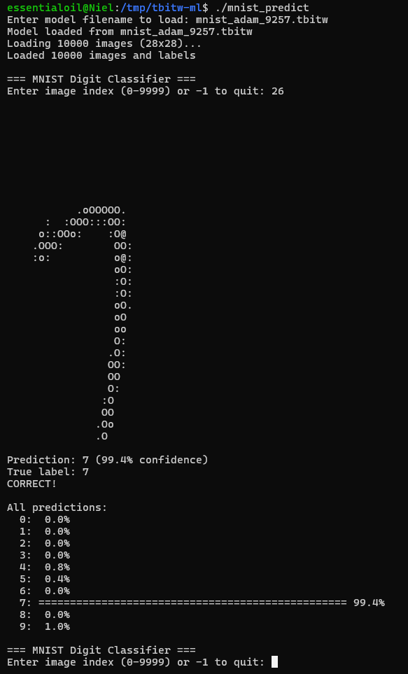
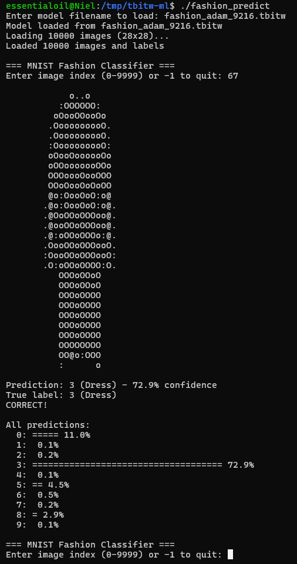

# TBITW ML Library

*A lightweight machine learning library built from scratch in C using only the standard library*[^1][^2]

## Results

| Dataset | Accuracy | 
|---------|----------|
| **MNIST Digits** | 92.37% | 
| **Fashion-MNIST** | 92.16% | 

I have provided 2 pre-trained models so you can instantly demo it without waiting to train!

## Quick Start

### MNIST Digit Classification

```bash
git clone https://github.com/dansyc11/tbitw-ml
cd tbitw-ml
make

# Try the pre-trained MNIST model
./mnist_predict
# Enter model filename to load: mnist_adam_9257.tbitw
# Enter image index (0-9999) or -1 to quit: 42
```

<p align="center">
  
</p>

### Fashion-MNIST Clothing Classification

```bash
# Classify clothing items
./fashion_predict
# Enter model filename to load: fashion_adam_9216.tbitw
# Enter image index (0-9999) or -1 to quit: 100
```

<p align="center">
  
</p>

Recognizes 10 categories: T-shirt, Trouser, Pullover, Dress, Coat, Sandal, Shirt, Sneaker, Bag, and Ankle boot.


```bash
# Classify clothing items
./fashion_predict
# Enter model: fashion_adam_9216.tbitw
# Enter index: 100
```

## Not-So-Quick Guide (Training Your Own)

Want to train from scratch instead of using pre-trained models?

### Train MNIST Model

```bash
# Train with Adam optimizer (20 epochs, ~3 minutes)
./mnist_adam

# Training output:
# Epoch 1: Accuracy = 45.50%
# Epoch 5: Accuracy = 87.67%
# Epoch 10: Accuracy = 90.68%
# Epoch 20: Accuracy = 92.37%
#
# Save trained model? (y/n): y
# Enter filename: my_mnist_model.tbitw
```

### Train Fashion-MNIST Model

```bash
# Train clothing classifier (20 epochs, ~3 minutes)
./fashion

# Training output:
# Epoch 1: Accuracy = 65.43%
# Epoch 5: Accuracy = 85.21%
# Epoch 10: Accuracy = 89.54%
# Epoch 20: Accuracy = 92.16%
#
# Save trained model? (y/n): y
# Enter filename: my_fashion_model.tbitw
```

Then use your model with `./mnist_predict` or `./fashion_predict`!


## Technical Details

See [Technical Documentation (PDF)](docs/technical_reference.pdf) for architecture details and how the algorithms were implemented.


---

[^1]: The name TBITW stands for The Best Thing In The World suggested by a friend during a random discord call

[^2]: Built with inspiration from Tsoding and Magicalbat's ML tutorials. Core machine learning algorithm implementations written from scratch with educational guidance from their teaching approach.
